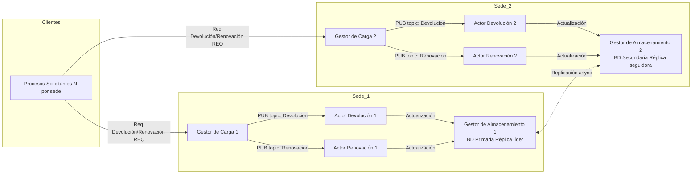
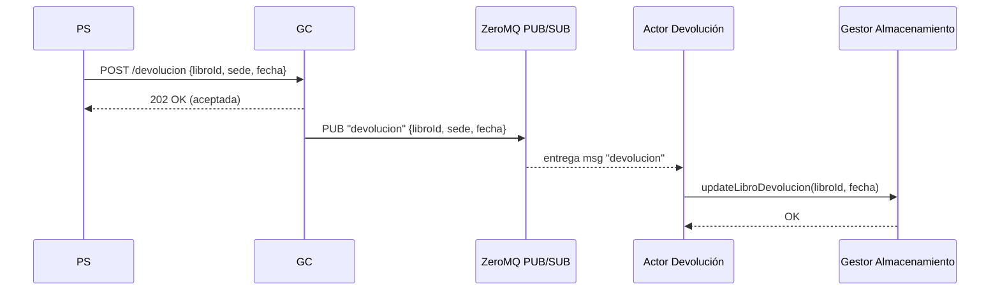
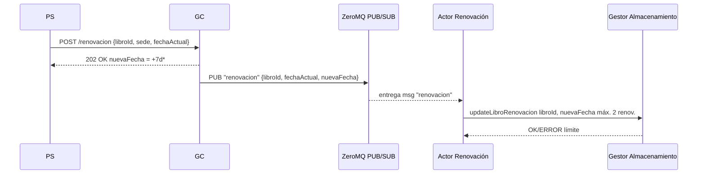
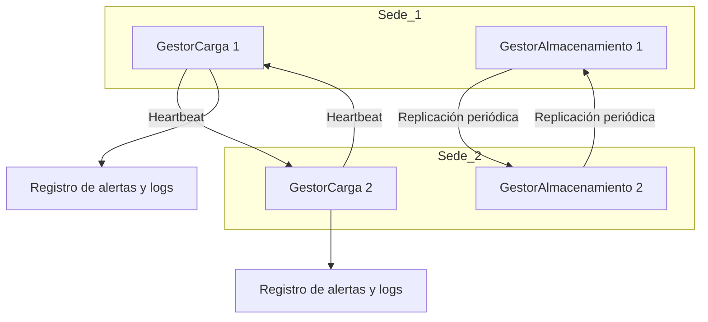
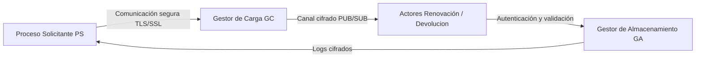
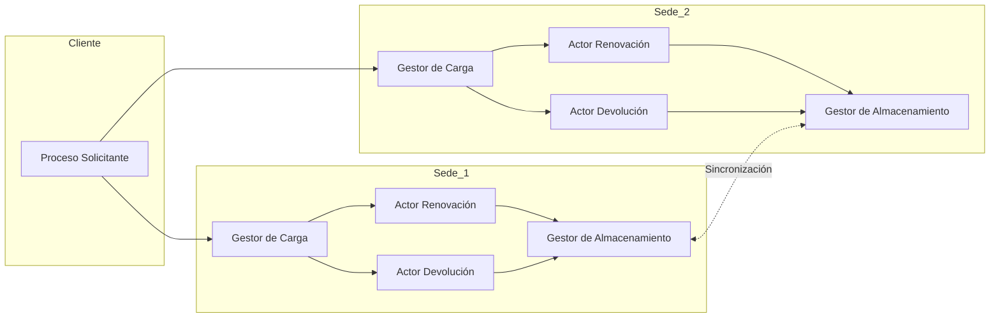
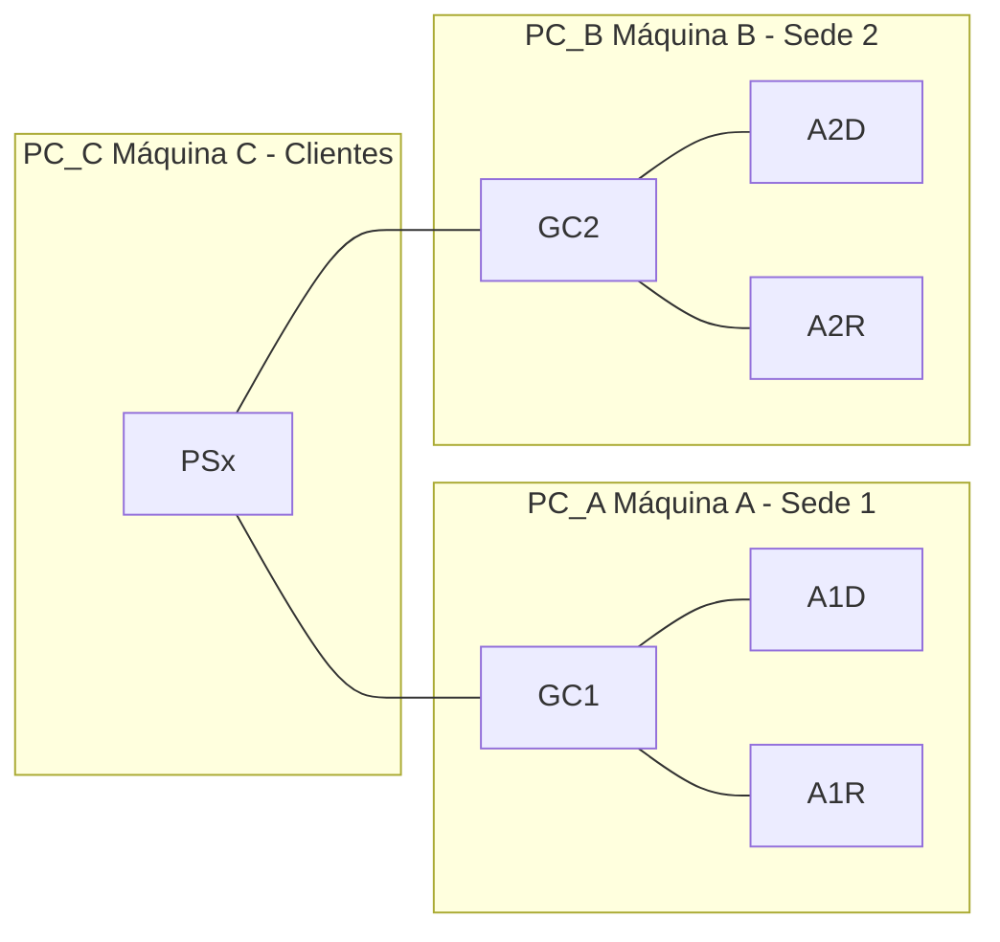
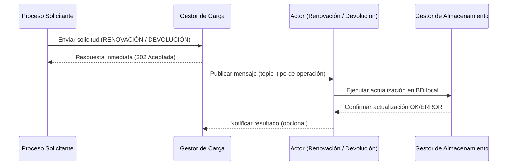

# 📘 Sistema Distribuido de Préstamo, Renovación y Devolución de Libros

Autores: Gabriel Jaramillo Cuberos, Roberth Méndez Rivera, Mariana Osorio Vásquez, Juan Esteban Vera Garzón 

## 🧩 Descripción general
Este proyecto implementa un sistema distribuido para la gestión de préstamos, devoluciones y renovaciones de libros en una biblioteca con múltiples sedes.
La arquitectura se basa en ZeroMQ (JeroMQ para Java) y usa los patrones REQ/REP y PUB/SUB para permitir comunicación entre los componentes.

## 🏗️ Arquitectura del sistema
El diagrama arquitectónico muestra la estructura global del sistema distribuido de préstamo de libros y la relación entre sus principales componentes desplegados en dos sedes. 

Cada sede cuenta con: 
- Un Gestor de Carga (GC) que recibe las solicitudes de los clientes y las publica hacia los actores.
- Dos Actores especializados: uno para renovaciones y otro para devoluciones, que consumen los mensajes del GC mediante el patrón PUB/SUB.
- Un Gestor de Almacenamiento (GA) responsable de mantener la base de datos local y sincronizar los cambios con su réplica en la otra sede. 

Los Procesos Solicitantes (PS), ubicados en la capa de clientes, pueden conectarse a cualquiera de los GC disponibles para enviar solicitudes de renovación o devolución. 
La comunicación entre los GA de ambas sedes se realiza de forma asíncrona mediante replicación, garantizando consistencia eventual. Este diseño distribuye la carga de procesamiento y asegura tolerancia a fallos mediante redundancia de sedes. 


## Modelo de interacción
Los diagramas de interacción describen el flujo dinámico de mensajes entre los procesos distribuidos para las operaciones principales: devolución y renovación. 

En ambos casos, la secuencia sigue el patrón asíncrono de confirmación inmediata al cliente y procesamiento en segundo plano: 

1. El Proceso Solicitante (PS) envía la solicitud al Gestor de Carga (GC).
2. El GC responde con un estado 202 Accepted para liberar al PS rápidamente y luego publica el evento en el canal ZeroMQ correspondiente (topic: renovación o devolución).
3. El Actor suscrito al tópico recibe el mensaje, ejecuta la lógica de negocio (verifica disponibilidad o número de renovaciones) y actualiza el estado del libro en el Gestor de Almacenamiento (GA).
4. El GA confirma la operación (OK o error) y registra el cambio en el archivo de persistencia local. 

Esta arquitectura basada en mensajería desacoplada permite alta concurrencia, resiliencia ante fallos y tiempos de respuesta bajos para el cliente. 
### Devolución 

### Renovación


## Modelo de fallos 
Este diagrama de fallos muestra los mecanismos de tolerancia implementados: 
- Los Gestores de Carga (GC1 y GC2) intercambian heartbeats periódicos para detectar caídas de nodo.
- Los Gestores de Almacenamiento (GA1 y GA2) sincronizan su estado por replicación periódica asíncrona.
- Si uno de los GA falla, el otro mantiene los datos hasta restablecer la conexión.
- Cada GC registra sus eventos de error en un módulo de logs y alertas locales, que luego puede revisarse para diagnóstico. 



## Modelo de seguridad 


## Diagrama de componentes 
Representa los módulos físicos de software desplegados en cada máquina. Cada sede replica la misma estructura lógica (GC + Actores + GA). 

La sincronización entre GA1 y GA2 se realiza de manera asíncrona, garantizando consistencia eventual. 


## 🖥️ Despliegue
### Diagrama de despliegue
El diagrama de despliegue representa la distribución física de los componentes del sistema sobre diferentes máquinas de la red. 
- Máquina A (Sede 1): ejecuta el GC1, el Actor de Renovación 1, el Actor de Devolución 1 y el GA1 (que contiene la base de datos primaria o réplica líder).
- Máquina B (Sede 2): ejecuta el GC2, el Actor de Renovación 2, el Actor de Devolución 2 y el GA2 (réplica seguidora).
- Máquina C (Clientes): aloja varios Procesos Solicitantes (PS) que generan carga de solicitudes hacia las sedes.   

La comunicación entre PS y GC utiliza el patrón REQ/REP, mientras que la comunicación entre GC y Actores usa PUB/SUB. 
Las GA de ambas sedes intercambian actualizaciones mediante replicación periódica y pueden continuar funcionando en modo degradado si una sede falla. 
Este despliegue garantiza disponibilidad, balanceo de carga y redundancia geográfica, cumpliendo los principios básicos de los sistemas distribuidos. 


### Requisitos:

Java 17 o superior
Librería JeroMQ
Dos o más máquinas en red local (LAN)
Archivos CSV y de carga en la carpeta data/

### Estructura de carpetas:
```
Lab3/
│── src/
│   ├── Gestor_Almacenamiento/
|        ├──BaseDatos.java
|        ├──Ejemplar.java
|        ├──GestorAlmacenamiento.java
|        ├──GestorAlmacenamientompl.java
|        ├──Libro.java
|        ├──ServidorGA.java
|   ├── Gestor_Carga/
|        ├──ActorClient.java
|        ├──BibliotecaGC.java
|        ├──BibliotecaGClmpl.java
|        ├──Message.java
|        ├──ServidorGC.java
│   ├── ClienteBatch.java
│   ├── libros.txt
│   ├── peticiones.txt
│── README.md
```

## Diagrama de secuencia
El Diagrama de Secuencia representa el flujo completo de interacción entre los componentes del sistema distribuido durante la ejecución de una operación (ya sea renovación o devolución). 



## ⚙️ Ejecución paso a paso
1. Compilar
2. Ejecutar

## 📊 Pruebas y métricas

Casos verificados:
- Devolución procesada en tiempo real.
- Renovación aceptada máximo 2 veces.
- Renovación 3ª vez → “Límite de renovaciones alcanzado”.
- Respuesta inmediata del GC (< 100 ms).
- Actualización visible en GA y CSV.

### Métricas recolectadas:
- Latencia promedio GC→Actor→GA.
- Throughput de mensajes/s.
- % de errores o pérdidas.
